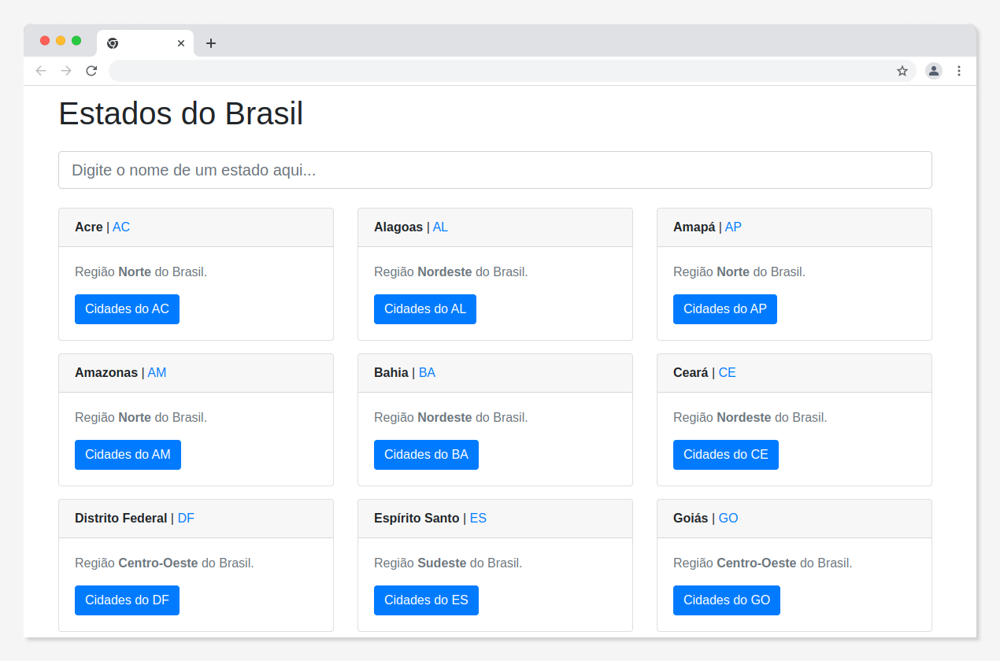
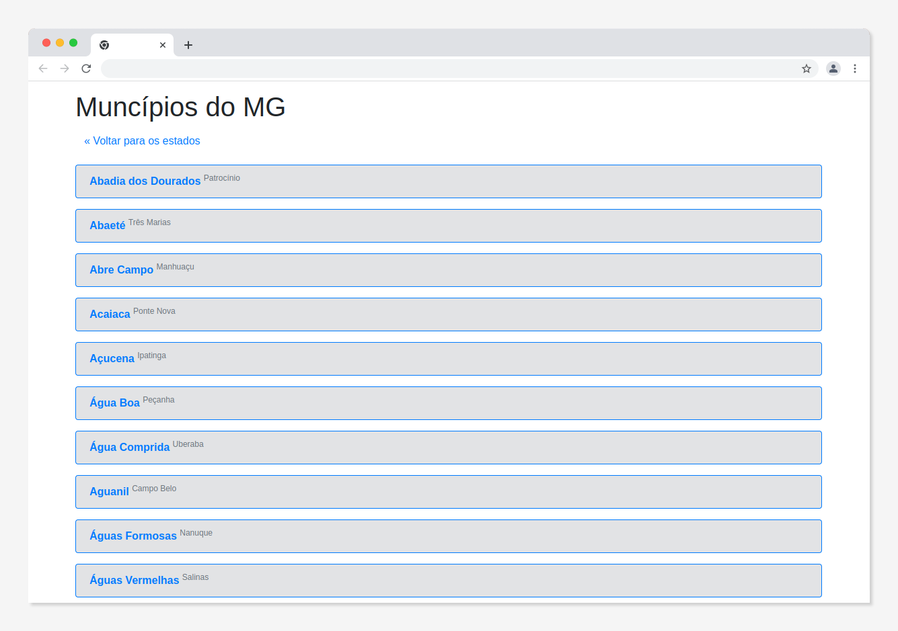

   


# TMX Mercury

TMX Mercury is a polished front-end project designed to help users explore Brazilian states and their counties through a fast, intuitive interface. The experience combines search, navigation, and responsive design to make regional data easy to browse.

Live demo: [https://tjmelo.github.io/tmx-mercury/](https://tjmelo.github.io/tmx-mercury/)

## Table of contents

- [Overview](#overview)
- [Highlights](#highlights)
- [Tech stack](#tech-stack)
- [AI-assisted development process](#ai-assisted-development-process)
- [Interface preview](#interface-preview)
- [Getting started](#getting-started)
- [Testing](#testing)
- [Contributing](#contributing)
- [License](#license)

## Overview

The project focuses on a simple but effective user journey:

- browse a list of Brazilian states
- search for a specific state quickly
- open the state to view its counties
- navigate through the interface without friction

This project was created as a portfolio-style showcase of modern frontend development, clean component structure, and a thoughtful user experience.

## Highlights

- Search for Brazilian states with a lightweight interaction model
- Explore counties by selecting a state card
- Responsive layout for desktop and mobile screens
- Smooth and accessible navigation experience
- Clean, maintainable component-based architecture

## Tech stack

The app is built with a modern React-based stack:

- React 18 + TypeScript
- React Router DOM for navigation
- Bootstrap and SCSS for styling
- Axios for API requests
- Jest and Testing Library for automated testing
- Webpack for build and bundling
- Docker support for containerized development

## AI-assisted development process

This project also reflects an AI-assisted workflow for modern software development:

- GitHub Copilot was used to accelerate component scaffolding and iteration
- AI support helped with TypeScript refinements, test suggestions, and code cleanup
- The development approach focused on readability, maintainability, and a portfolio-ready presentation

The goal was not just to build a functional app, but to create a clear example of how AI tools can support faster, more structured frontend development.

## Interface preview

A glimpse of the latest interface:





## Getting started

### Local development

```sh
git clone https://github.com/tjmelo/tmx-mercury.git
cd tmx-mercury
npm install
npm start
```

Then open: http://localhost:3000/tmx-mercury

### Docker development

```sh
git clone https://github.com/tjmelo/tmx-mercury.git
cd tmx-mercury
docker compose up -d
```

You can also pull the published image:

```sh
docker pull ghcr.io/tjmelo/tmx-mercury:latest
```

## Testing

Run the test suite with:

```sh
npm test
```

## Contributing

Contributions are welcome. If you plan to make a significant change, feel free to open an issue first so the direction can be discussed clearly.

## License

MIT
